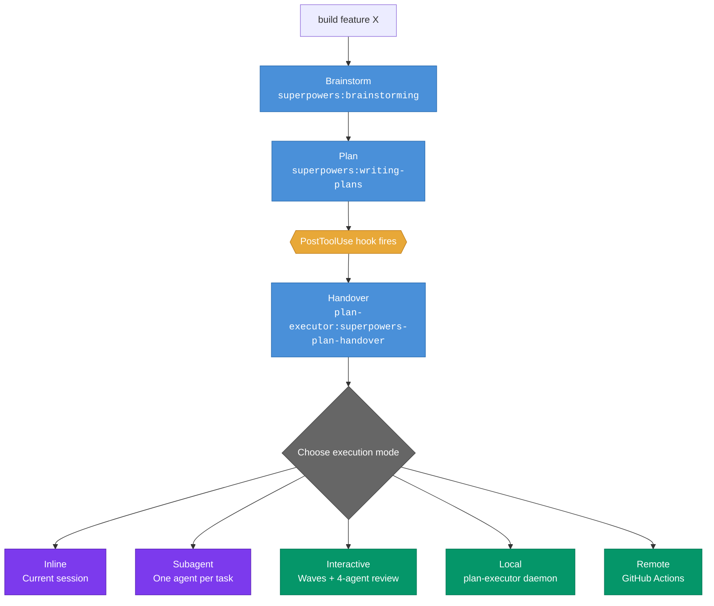

# plan-executor-plugin

Claude Code plugin marketplace for plan execution pipeline — orchestration, validation, code review, and binary dependency management.

## Install

```bash
bash -c "$(gh api 'repos/andreas-pohl-parloa/plan-executor-plugin/contents/install.sh' --header 'Accept: application/vnd.github.raw')"
```

Requires the [GitHub CLI](https://cli.github.com) (`gh`) authenticated. The `plan-executor` and `sjv` binaries are auto-installed from GitHub releases on first session start.

From a local clone:

```bash
./install.sh
```

The script is idempotent: re-running it does a clean reinstall (removes, clears cache, re-adds).

## Planning and Execution Flow



| Step | What happens |
|------|-------------|
| **Brainstorm** | `superpowers:brainstorming` explores the idea, asks questions, writes a design spec |
| **Plan** | `superpowers:writing-plans` turns the spec into a step-by-step implementation plan |
| **Handover** | `PostToolUse` hook triggers `plan-executor:superpowers-plan-handover` — user chooses a mode |
| **Inline / Subagent** | Execute directly via Superpowers skills |
| **Interactive** | Wave-based execution with code review (Claude + Codex + Gemini + Security) and plan validation |
| **Local** | Hand off to the `plan-executor` daemon on the local machine |
| **Remote** | Hand off to GitHub Actions for non-interactive execution |

> [!WARNING]
> Remote execution requires one-time setup — see [Remote Setup](#remote-setup) below.

## Skills

| Skill | Description |
|-------|-------------|
| `/plan-executor:execute-plan` | Execute a READY plan interactively with review checkpoints |
| `/plan-executor:execute-plan-non-interactive` | Execute a plan via deterministic non-interactive handoffs |
| `/plan-executor:pr-finalize` | Fix bug comments on a PR |
| `/plan-executor:review-execution-output` | Review completed execution output in the current agent |
| `/plan-executor:review-execution-output-non-interactive` | Non-interactive code review via prompt-file handoffs |
| `/plan-executor:run-reviewer-team` | Launch parallel Claude + Codex + Gemini + Security reviewer set |
| `/plan-executor:run-reviewer-team-non-interactive` | Non-interactive reviewer dispatch and triage via handoffs |
| `/plan-executor:superpowers-plan-handover` | Hand a Superpowers plan over into the execution flow |
| `/plan-executor:validate-execution-plan` | Validate a plan against implementation output (interactive) |
| `/plan-executor:validate-execution-plan-non-interactive` | Validate a plan with persisted state (non-interactive) |

## Remote Setup

Remote execution dispatches plans to GitHub Actions via a dedicated executions repository. One-time setup is required.

```bash
plan-executor remote-setup
```

The interactive wizard creates a private executions repository on GitHub (you just give it a name), configures `~/.plan-executor/config.json` with the `remote_repo` slug, and stores the required secrets (`ANTHROPIC_API_KEY`, etc.) so runners can authenticate.

After setup, `~/.plan-executor/config.json` contains a `remote_repo` entry:

```json
{
  "remote_repo": "your-org/plan-executions"
}
```

Re-run `plan-executor remote-setup` at any time to update the configuration.

### Agent configuration

The config file also supports an `agents` section that defines the CLI commands used to launch each agent type during execution:

```json
{
  "agents": {
    "main": "claude --dangerously-skip-permissions --verbose --output-format stream-json",
    "claude": "claude --dangerously-skip-permissions -p",
    "codex": "codex --dangerously-bypass-approvals-and-sandbox exec",
    "gemini": "gemini --yolo -p"
  },
  "remote_repo": "your-org/plan-executions"
}
```

- **`main`** — the primary orchestrator agent (streams output)
- **`claude`** — Claude sub-agent for implementation, review, and validation handoffs
- **`codex`** — Codex sub-agent for code review (can-fail)
- **`gemini`** — Gemini sub-agent for code review (can-fail)

## Structure

```
.claude-plugin/marketplace.json        # marketplace manifest
plugins/
  plan-executor/
    .claude-plugin/plugin.json         # plugin manifest
    hooks/
      hooks.json                       # PostToolUse + SessionStart hooks
      post-tool-use-skill.sh           # injects plan-handover reminder after writing-plans
      session-start.sh                 # auto-installs plan-executor and sjv binaries
    skills/<name>/SKILL.md             # one directory per skill
```

## Hooks

The `plan-executor` plugin registers two hooks:

- **PostToolUse** — fires after every `Skill` tool call. When `superpowers:writing-plans` is invoked, injects a mandatory reminder to run `plan-executor:superpowers-plan-handover`.
- **SessionStart** — checks if `plan-executor` and `sjv` binaries are available. Downloads prebuilt binaries from GitHub releases if missing.
